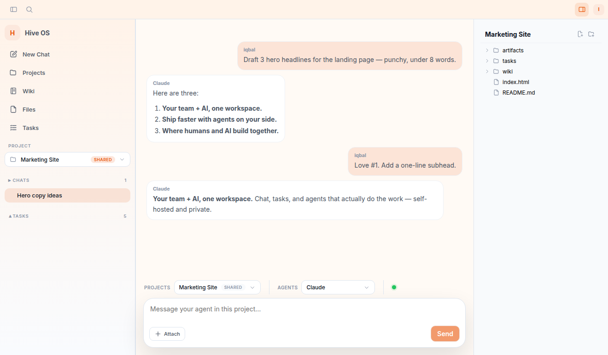
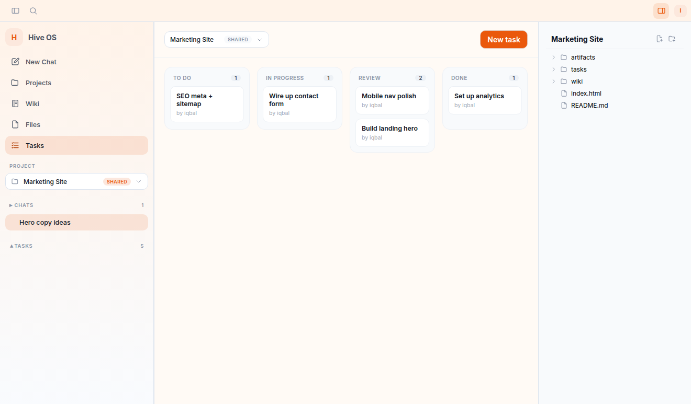
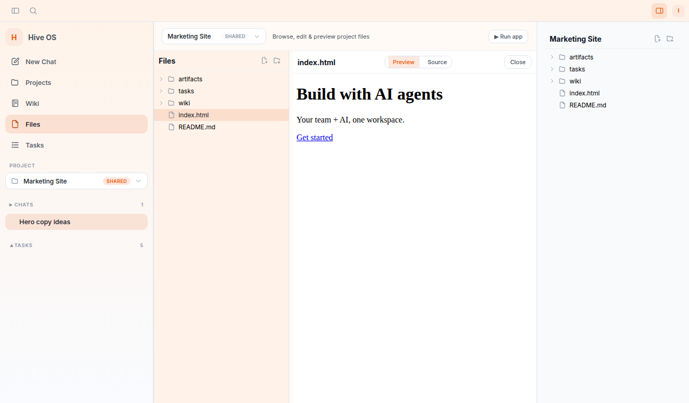
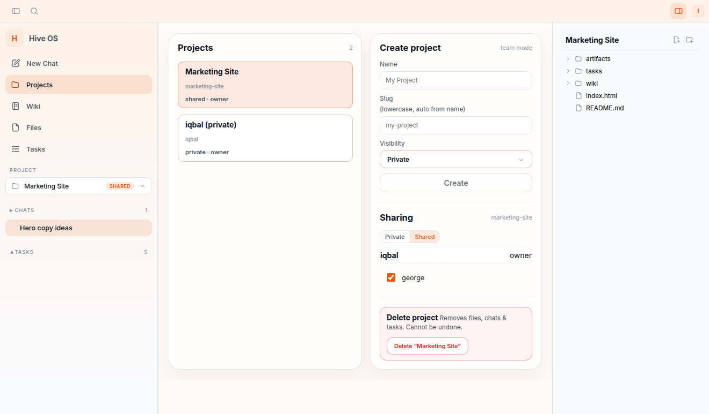
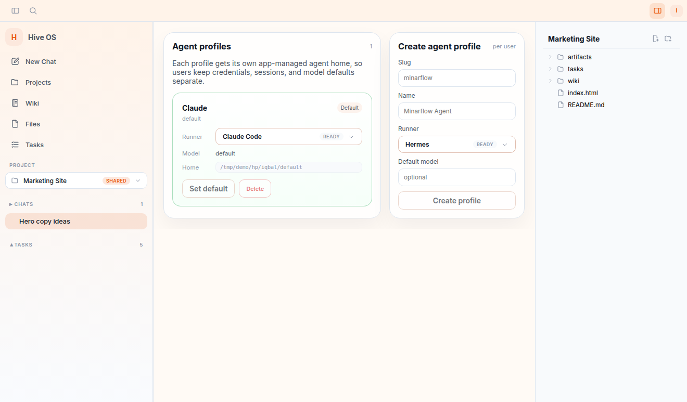
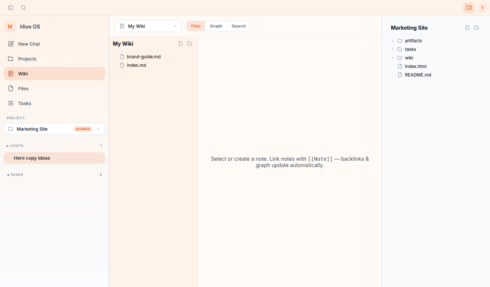
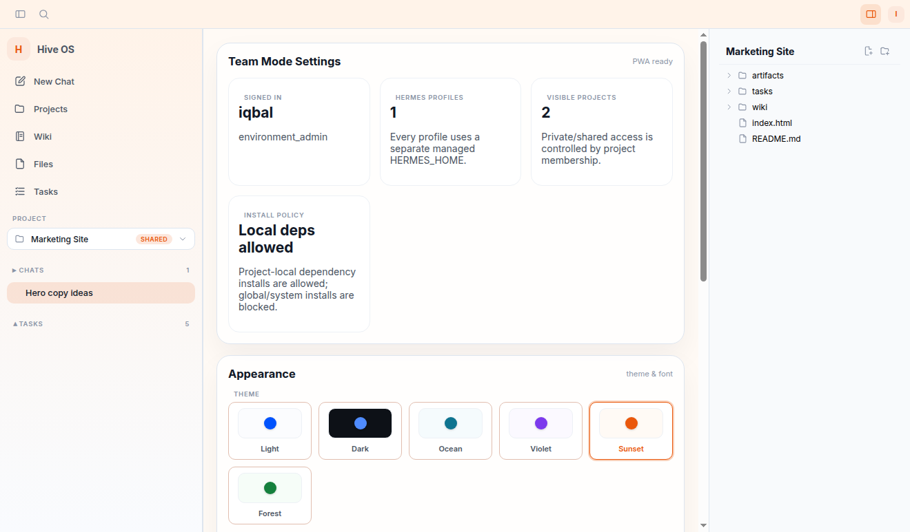

# Hive OS

Self-hosted, multi-user **agent workspace** — chat, tasks, files, wiki, and
run-and-preview, where your team and its AI agents work together in one private
space. Bring your own agent: **Claude Code, Codex, Gemini CLI, or Hermes**.



## What it is

A team workspace you self-host as a background service and reach from any browser
(or phone via Tailscale). FastAPI backend + React PWA. It's a **control plane** —
it drives agents over the Agent Client Protocol (ACP), so you plug in whichever
agent you (and each teammate) prefer.

Features:
- **Multi-runner** — pick a runner per profile: **Claude Code, Codex, Gemini CLI, or Hermes**. Credentials auto-seed from the host so a new profile works out of the box.
- **Chat with agents** — streaming responses, tool-activity cards, slash commands, session continuity. Messages show real sender + agent names for clear collaboration.
- **Tasks (kanban)** — each task has a transparent, steerable agent thread. Agents move tasks to Review; a human clicks **Approve & Done**.
- **Files** — per-project browser with edit + live HTML/Markdown **preview**, plus **Run & Preview** for dev servers.
- **Wiki** — linked notes (`[[Note]]`) with an auto-updating graph.
- **Teams & sharing** — roles, invite links, and per-project member toggles (share to exactly who you choose).
- **Themes & PWA** — six themes; installable on desktop or phone.

## Screenshots

| Tasks (kanban) | Files + live preview |
|---|---|
|  |  |
| **Projects & sharing** | **Agents & runners** |
|  |  |
| **Wiki** | **Themes & settings** |
|  |  |

## Requirements

- **Linux, macOS, or Windows** (no Docker required)
- [`uv`](https://docs.astral.sh/uv/) and Node.js / `npm`
- At least one **agent CLI** installed + logged in: Claude Code, Codex, Gemini CLI, or Hermes

See [docs/installation.md](docs/installation.md) for Linux, macOS, and Windows install steps.

## Quickstart

```bash
git clone https://github.com/minarflow/hive-os
cd hive-os
bash scripts/install-user
```

Open `http://127.0.0.1:8765` — the first visit walks you through creating the admin account.

Manage the service:

```bash
systemctl --user status hive-os
systemctl --user restart hive-os
systemctl --user stop hive-os
```

## Bring your own agent

Hive OS ships **no credentials**. Each profile picks a runner (Claude Code,
Codex, Gemini CLI, or Hermes). Log into that agent's own CLI the way you normally
would — Hive uses your existing login and **never asks for or stores provider
passwords**. Pick the runner when you create a profile and it's ready to use.

## Security / trust model

Hive OS enforces access at the **application** level (membership + role checks), not the OS level. Agents run with the **same privileges as the server process** — they can read and write files and run tools on the host. This is by design and appropriate for a **trusted team on a private network** (e.g. a Tailnet).

Do **not** expose Hive OS to untrusted users without adding OS-level isolation (e.g. running it in a container). See [docs/security-boundaries.md](docs/security-boundaries.md) for the full boundary description.

## Tailscale / phone access

```bash
sudo tailscale set --operator=$(whoami)   # one-time
tailscale serve --bg 8765
```

Open your HTTPS MagicDNS URL on any device and install the PWA.

## Repository layout

```text
apps/api/        FastAPI backend
apps/web/        React/Vite PWA
infra/scripts/   optional ACL/project helper
infra/systemd/   service templates
docs/            architecture, install, security, backup docs
scripts/         build/dev/install/backup wrappers
templates/       project workspace templates
```

## Docs

- [Installation](docs/installation.md)
- [Security boundaries](docs/security-boundaries.md)
- [Architecture](docs/architecture.md)
- [Backup & recovery](docs/backup.md)

## License

[MIT](LICENSE)
